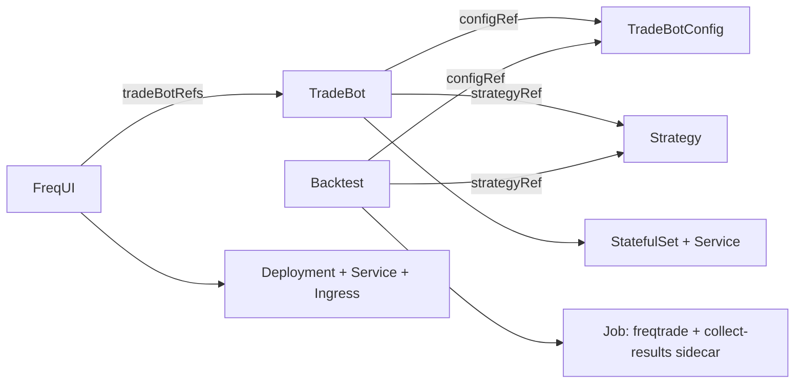

# Architecture

How this operator is put together, for anyone reading or changing the code itself. For how to
*use* the operator, see the main [README](../README.md); for the full generated field reference,
see [api-reference.md](api-reference.md).

## The five CRDs

| CRD | API version(s) | Controller | Owns / produces |
|---|---|---|---|
| `TradeBotConfig` | `v1alpha1` | `controllers/tradebotconfig` | Validation + status only. `configbuilder/` renders freqtrade's `config.json` from it; nothing else does. |
| `Strategy` | `v1alpha1` | `controllers/strategy` | Validation + status only - checks the script is a loadable Python module with a valid `IStrategy` class name. |
| `TradeBot` | `v1alpha1` (converted) + `v1beta1` (storage) | `controllers/tradebot` | Secret (`config.json`), ConfigMap (strategy `.py`), PVC (trades DB), StatefulSet + Service. Trade-only - see [Two API versions](#two-api-versions) below. |
| `FreqUI` | `v1alpha1` | `controllers/frequi` | Deployment, Service, Ingress; reads the `TradeBot`s it references back to derive CORS origins for each one's `config.json`. |
| `Backtest` | `v1beta1` only | `controllers/backtest` | Job (one-shot), a per-run results PVC, and a native sidecar that extracts a results summary. |

All references (`configRef`, `strategyRef`, `tradeBotRefs`) resolve by bare name in the
referencing object's own namespace only - deliberate (D3 below), not a gap to fill in later with
cross-namespace syntax.

## Two API versions

`TradeBot` is the only CRD with both a `v1alpha1` and a `v1beta1` representation.
`TradeBotConfig`, `Strategy`, and `FreqUI` never got a `v1beta1` - there was nothing about their
own shape that P6-x's changes needed to touch. `Backtest` is the reverse case: it only ever
existed as `v1beta1`, introduced already carrying the reference-type and naming conventions the
rest of `v1beta1` established.

`v1beta1.TradeBot` is the **storage version** - what's actually persisted in etcd - and
`v1alpha1.TradeBot` converts to/from it on every read and write
(`api/v1alpha1/tradebot_conversion.go`). The conversion is not always lossless in one direction:
a `v1alpha1` `TradeBot` with `spec.freqtrade_command` set to anything other than `trade` (the old
"Job mode" - one-shot backtesting runs done via `TradeBot` itself, before `Backtest` existed as
its own CRD) has no `v1beta1` equivalent at all, and the conversion webhook rejects converting one
rather than silently dropping what it was configured to do. Round-trip correctness for everything
that *does* convert cleanly is covered by a fuzz test
(`api/v1alpha1/tradebot_conversion_test.go`) - the thing worth guarding against here is a field
silently dropped in one direction, which a handful of hand-written example conversions won't
reliably catch but a fuzz test will.

## Config rendering

A `TradeBotConfig` never touches a real filesystem itself - `controllers/tradebotconfig` only
validates it and reports status. The actual `config.json` freqtrade reads is rendered by
`controllers/tradebotconfig/configbuilder` and written into a Secret by `controllers/tradebot`
each time a `TradeBot` reconciles (D2: whether that changed config takes effect immediately or
merely gets reported depends on `spec.updateStrategy`, `Manual` or `Auto`). One `TradeBotConfig`
can be referenced by any number of `TradeBot`s or `Backtest`s in the same namespace - rendering is
stateless and reference-counted only in the sense that the config object itself doesn't know or
care how many things point at it.

Credentials (exchange API keys, the freqtrade REST API's own password, Telegram's bot token) have
two paths onto a `TradeBotConfig`: a deprecated plaintext field on the spec itself (rejected by
the admission webhook unless `freqtrade.io/allow-plaintext-credentials` is set - P3-1), or a
`secretRef` naming a `Secret` in the same namespace. `secretRef` always wins when both are
present. See [`examples/`](../examples/) for the actual `Secret` shapes each `secretRef` expects
- the exact key names it reads matter and aren't always what you'd guess (the API server's
`secretRef`, for instance, reads a key literally named `user`, not `username`).

## `TradeBot`: the live-trading path

A `trade`-mode `TradeBot` gets a `StatefulSet` (one replica; `StatefulSet` rather than
`Deployment` purely for the stable pod identity a trades database PVC wants) running the real
freqtrade image, a `Service` fronting its REST API, and a PVC holding `tradesv3.sqlite` across pod
restarts. Everything runs under a `restricted` Pod Security Standard-compatible `SecurityContext`
(P3-3) with no `NetworkPolicy` hole beyond what `FreqUI` specifically needs (P3-4).

`controllers/tradebot/poller.go` is a separate, non-reconcile-loop process (only the leader
replica runs it) that polls each `TradeBot`'s own REST API on `spec.introspection.interval` (10s
minimum, enforced by the admission webhook - freqtrade's API isn't built for tight polling loops,
and this operator is not a market-data source) via `controllers/tradebot/botclient`. What it finds
lands in `status.bot` and drives the `BotReachable` condition plus a set of
`freqtrade_bot_*` Prometheus metrics - deliberately decoupled from `Reconcile` itself so a slow or
unreachable bot's HTTP calls can never stall reconciliation of that `TradeBot`, or any other.

## `Backtest`: the one-shot path

A `Backtest` is immutable after creation (enforced by a CEL rule on the whole spec, not just
convention) - its name *is* the run's identity, not a label you reuse across edits. Its `Job` runs
three containers in sequence plus one alongside: `init-user-data` (scratch directories),
optionally `init-download-data` (only when `spec.data.pvcName` is set - freqtrade's own
`download-data` against a pre-existing, user-provisioned cache PVC; the operator never
auto-provisions this one), the `freqtrade` container itself (`backtesting`), and
`collect-results` - a **native sidecar** (`restartPolicy: Always` on an `initContainers` entry,
GA since Kubernetes 1.29), which is what makes this a five-container pod rather than a plain
Job-with-a-single-container.

`collect-results` runs the operator's own binary (`/manager collect-results`, not a second image
to build and release), waits for the `freqtrade` container to exit, then does two independent,
independently-fault-tolerant things: copies the raw result file onto the per-run results PVC (D1 -
durable beyond the Job pod's own ephemeral storage), and extracts a small summary into a
`<name>-results` ConfigMap the reconciler reads back into `status.results` (D6). It runs as its
own `ServiceAccount` (`freqtrade-backtest-sidecar`, one per namespace, shared by every `Backtest`
in it - not the manager's own identity), with exactly two RBAC verbs: `configmaps:
{get,create,update}` for its own results ConfigMap, and `pods:get` so it can poll its own Pod's
`containerStatuses` to learn when the main container has exited - the only way a native sidecar
can detect that at all, since Kubernetes gives it no exit hook of its own.

The moment every regular container in the pod exits, kubelet sends every remaining native sidecar
a SIGTERM - `collect-results` treats that as "go check right now" rather than the default Go
disposition ("die immediately, nothing flushed"), since kubelet's own exit detection is reliably
faster than any fixed polling interval could otherwise notice on its own.

## RBAC model

Two identities, deliberately not one:

- The manager's own `ServiceAccount` (`freqtrade-operator-controller-manager`) holds a
  cluster-scoped `ClusterRole` - full CRUD on the CRDs themselves and everything the reconcilers
  create (Secrets, ConfigMaps, PVCs, StatefulSets, Jobs, Services, Ingresses).
- The `Backtest` sidecar's `ServiceAccount` holds a narrow, namespace-scoped `Role` (above) - it
  runs inside a Job pod whose `spec.pod` a `Backtest`'s own author can otherwise influence, so it
  gets the least privilege that lets it do its one job, not the manager's own broader identity.

A `Role`/`ClusterRole` can never grant privileges its own creator (the manager) doesn't already
hold - relevant when changing either: a new verb added to the sidecar's `Role` needs the manager's
own `ClusterRole` to already cover it, or the grant itself fails at apply time.

## Design decisions

Settled choices, not things still open for debate - recorded here (moved from this project's
now-removed internal planning document) so the reasoning survives, since a fair amount of code
comments across this repo reference these by their `D`-number.

| # | Decision | Why |
|---|---|---|
| **D1** | One-shot runs get their own CRD (`Backtest`), with its own per-run results PVC. `TradeBot` is trade-only. | A live bot is a mutable singleton you edit in place; a backtest is an immutable fact about a `(strategy, config, timerange, data)` tuple you want many of, with history. Forcing both through one CRD is why the old `TradeBot` "Job mode" needed a spec-hash suffixed onto the Job name just to avoid collisions. |
| **D2** | Config changes default to `Manual` (report drift via a condition, don't restart the bot), configurable to `Auto`. | A bot already holding open positions shouldn't get silently restarted out from under them just because its `TradeBotConfig` changed; `Auto` exists for anyone who's decided that tradeoff is fine for their own setup (e.g. nothing live yet). |
| **D3** | Same-namespace references only, everywhere (`configRef`, `strategyRef`, `tradeBotRefs`, `secretRef`). | Not a limitation to engineer around later - a documented constraint. Namespace boundaries are this operator's actual isolation mechanism between trading environments; cross-namespace references would undermine that. |
| **D4** | The operator polls each bot's own freqtrade REST API for live state (introspection). | `status.bot` otherwise only ever reflects what the operator itself last *told* the bot to be, never what it's actually doing - open trades, profit, whether it's even reachable. |
| **D5** | Typed fields per command (`Backtest`'s `timerange`/`timeframe`/`pairs`/...) replace free-form argument lists as the primary API surface. | A typed field validates at admission time and shows up in `kubectl get`/`kubectl explain`; a free-form argument string does neither. |
| **D6** | `Backtest` results are extracted by a native sidecar writing a ConfigMap, not read directly by the reconciler. | The reconciler has no access to a Job pod's own filesystem; a sidecar sharing that pod's volumes does, and can act the instant the run finishes rather than on the reconciler's own poll cadence. |
| **D7** | `Backtest` ships alone in the first `v1beta1` release. `Hyperopt` (parameter optimization) follows as its own CRD in a later minor. | `RunSpec` (embedded via `json:",inline"`) is already split out specifically so `Hyperopt` can reuse it later with zero API churn on `Backtest` - but `Hyperopt` itself isn't built yet, and shipping it half-considered alongside a from-scratch `Backtest` wasn't worth the delay. |
| **D8** | `Backtest`/`Hyperopt` keep an annotation-gated `extraArgs` escape hatch, checked against a denylist. | Typed fields cover the common cases, but freqtrade's own CLI surface is larger than this API will ever fully mirror - `extraArgs` is the pressure valve for the rest, deliberately not the default path (`freqtrade.io/allow-extra-args: "true"` is required, and every value is checked against the flags the operator itself already controls). |
| **D9** | Bot introspection (D4) stays permanently read-only. A future, separate, explicit `spec.state` write path (start/stop) is deliberately scoped out of it rather than added to the same poller - not yet built as of this writing (`status.bot.state` reports what a bot *is*, read-only; nothing sets it). forceexit/forcebuy/forceenter-class endpoints are permanently out of scope, not merely deferred, regardless. | Giving the introspection poller any write capability at all would blur "observes state" into "controls trading," which needs its own threat model, review, and explicit opt-in - never something that falls out of a metrics-collection loop by accident. |
| **D10** | Results PVCs accumulate; there is no cluster-wide pruning, only a per-object `RetentionPolicy` (default `Delete`, GCs the PVC when its `Backtest` is deleted). | The right pruning policy depends on how a team actually uses backtesting (a handful of curated runs vs. a sweep harness generating hundreds), which is unknowable in advance. `kubectl delete backtest -l ... --field-selector status.phase=Succeeded` is the working manual reaper until a real usage pattern justifies building more. |
